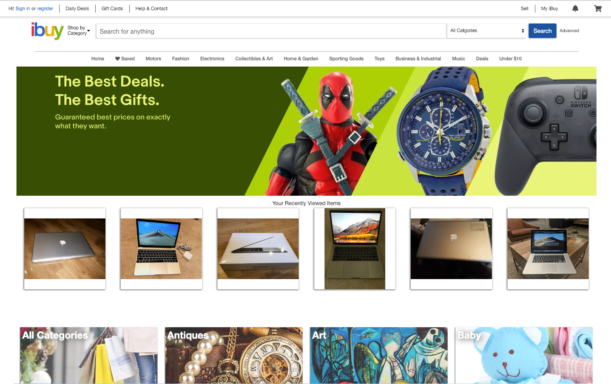
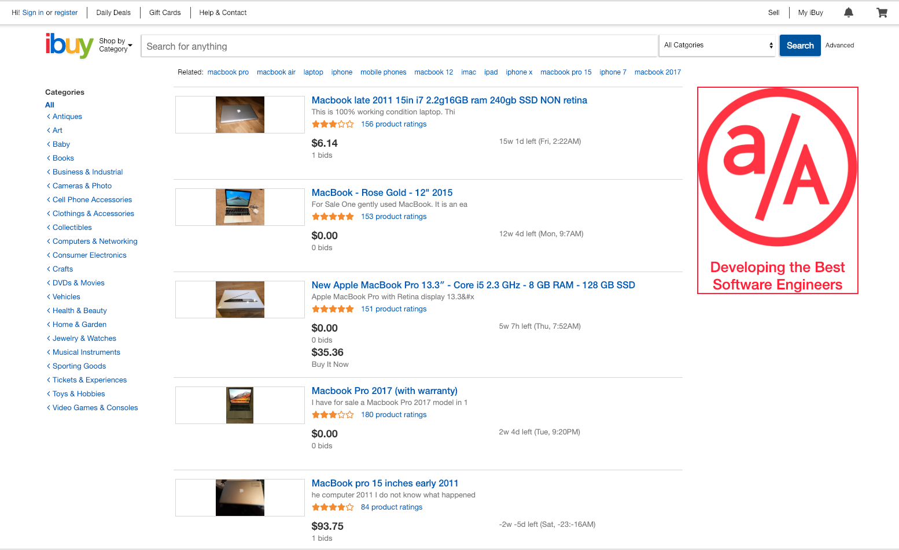
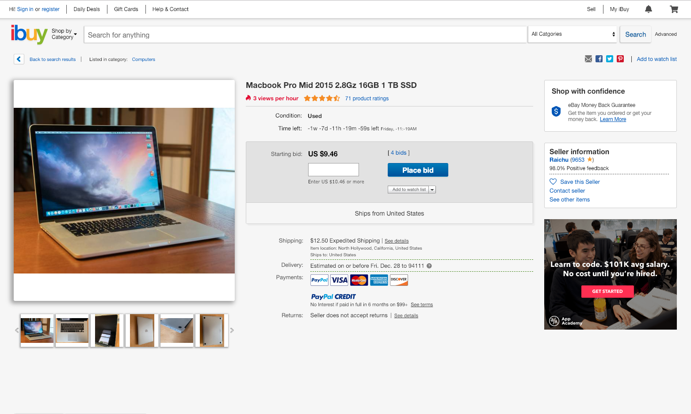

# iBuy

[iBuy](https://ibuyapp.herokuapp.com) is a portfolio E-commerce application inspired by Ebay. iBuy implements many of the core features of Ebay, including:

- Secure user authentication
- New user creation with:
  - validations
  - password encryption
- Product Search by:
  - Key words
  - Category
- Shortcuts for faster navigation



In order to populate the site with relavant product data optimally, a Node webscraper was built to write a Rails seed file and source images of over 3,000 products. [Amazon Web Services S3](https://aws.amazon.com/s3/) cloud storage platform was incorperated as well in order to store and serve images.

## Technologies

### Backend

- Ruby on Rails
- PostgreSQL

### Frontend

- React
- Redux

### Other

- AWS S3
- Cheerio JS (web scraper)
- Webpack / Babel

## Key Features

### Item Search

On each page of iBuy, a search bar is present in order to create a pleasant User Experience (UX). Along with this search bar, various links were available to allow the user to search various categories on click.

The choice to fetch the items upon component mounting and to pull the search query from the url's query string was made so that the search query had a single source of truth on which items to fetch from the backend. This decision also created a pleasant UX with minimal trade off as the user could keep their results upon page refresh, upon revisiting the url, and upon sharing the url with friends (trade off being less than 100ms delay).



```javascript
constructor(props) {
  super(props);
  this.state = {
    queryString: this.props.location.search,
    loading: true
  };
}

componentDidMount() {
  this.props.searchProducts(this.parsedQueryString());
}

componentDidUpdate(prevProps, prevState, snapshot) {
  const queryString = this.props.location.search;
  if (this.state.queryString !== queryString) {
    this.props.dispatchLoading();
    this.setState({ queryString, loading: true }, () => {
      this.props.searchProducts(this.parsedQueryString());
    });
  } else if (this.state.loading && !this.props.loading) {
    this.setState({ loading: this.props.loading });
  }
}
```

### Displaying Recently Viewed Items

On the homepage, iBuy displays the 6 most recent items that the user has viewed to display the items he/she expressed interest in.  In order to implement this feature without requiring the user to log in, a cookie was stored on their browser holding IDs for the items they recently viewed.

```ruby
  def show
    @product = Product.with_attached_photos.includes(:bids, :owner, :category).find_by_id(params[:id])
    if @product
      attach_viewed_products_cookie(@product)
      render :show
    else
      render json: ["No product Found"], status: 204
    end
  end

  def attach_viewed_products_cookie(new_product)
    id = new_product.id
    unless session[:viewed_products].include?(id)
      session[:viewed_products] = session[:viewed_products][0..4].unshift(id)
    end
  end
```



## Future Features

Given the 10-day timeline of this project, it was not possible to implement the site's full functionality. Top priorites for furter work include:

- Allowing users to view their watched/bid items
- Allow users to post an item for sale
- Search result sorting
